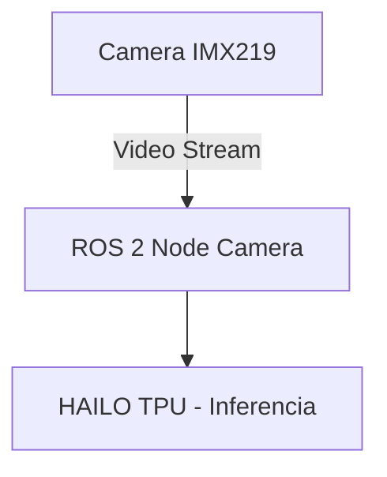
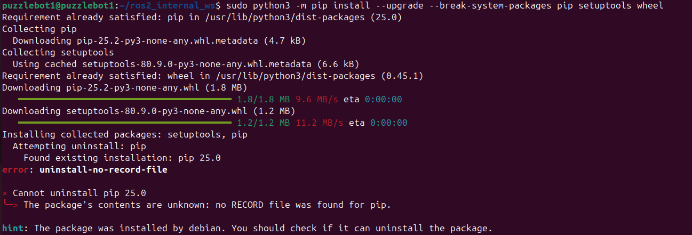
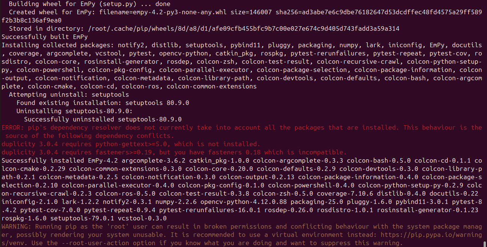
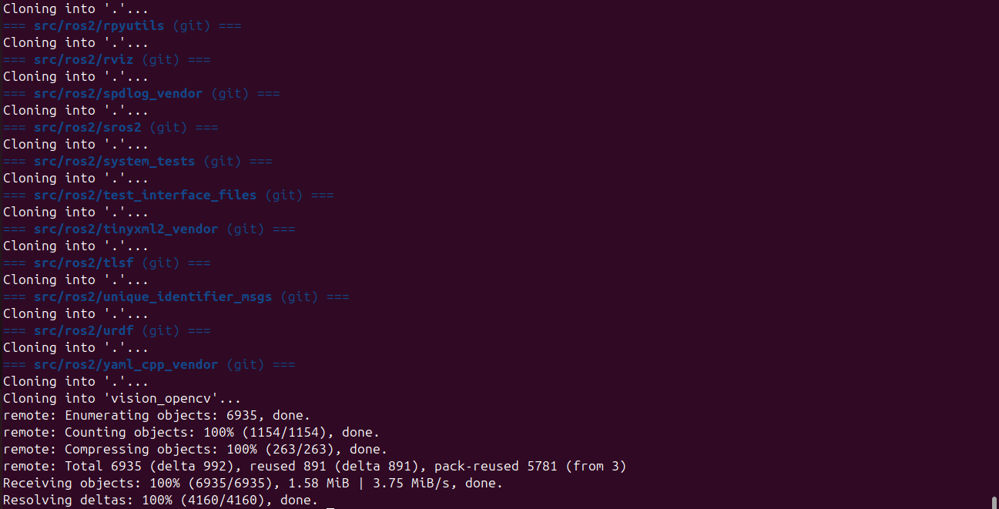

# |Manual-Pizzlebot|
#  Instalación de ROS 2 Jazzy + HAILO TPU + Cámara RPi V2 en Raspberry Pi 5 (Ubuntu 25.04)

##  Introducción

Este manual/documentación tiene como propósito guiar paso a paso la instalación, configuración y puesta en marcha de un entorno de desarrollo robótico sobre una **Raspberry Pi 5** con **Ubuntu 25.04**.  

La plataforma integra tres componentes clave:

-  **ROS 2 Jazzy**: framework de robótica para comunicación entre nodos, sensores y actuadores, diseñado para sistemas distribuidos y escalables.  
-  **HAILO TPU (AI HAT con chip Hailo-8L)**: acelerador de inteligencia artificial optimizado para visión por computadora e inferencia en tiempo real, con alto rendimiento y bajo consumo energético.  
- 📷 **Cámara Raspberry Pi V2 (IMX219)**: módulo de cámara de 8 MP que, junto con el TPU, habilita aplicaciones de visión artificial como detección de objetos, reconocimiento de señales y navegación autónoma.  

El objetivo principal es contar con una plataforma más **estable, eficiente y de bajo consumo** en comparación con soluciones previas como la **Jetson Nano**, manteniendo compatibilidad con ROS 2 y asegurando que los pasos de instalación sean **reproducibles**.

---

##  Objetivo General

Documentar y estandarizar el proceso de instalación y configuración de una **Raspberry Pi 5** con **Ubuntu 25.04**, integrando **ROS 2 Jazzy**, la **cámara IMX219** y el **TPU Hailo-8L**, para implementar un entorno de visión e inteligencia artificial optimizado para aplicaciones de robótica móvil.

---

## 🛠 Contenido del manual

1. **Preparación del entorno**  
   - Instalación de Ubuntu 25.04 en Raspberry Pi 5  
   - Configuración inicial del sistema  

2. **Instalación de ROS 2 Jazzy**  
   - Dependencias y herramientas (`colcon`, `rosdep`)  
   - Configuración de entorno y verificación con nodos básicos  

3. **Configuración de la cámara IMX219**  
   - Habilitación de controladores  
   - Pruebas de captura y validación de video  

4. **Instalación y uso del HAILO TPU**  
   - Instalación de **HailoRT**  
   - Carga de modelos (`.hef`)  
   - Ejecución de inferencias de prueba  

5. **Integración completa**  
   - Nodos ROS 2 para cámara + inferencia en TPU  
   - Visualización en **RViz** y **OpenCV**  

---

## Requisitos previos

- Raspberry Pi 5  
- MicroSD de al menos **64 GB** o SSD recomendado  
- Fuente de poder adecuada (mínimo 5V/5A)  
- Ubuntu 25.04 para Raspberry Pi  
- Módulo de cámara IMX219  
- Hailo-8L AI HAT TPU  

---

## Vista general de la arquitectura



## Actualizar sistema.
```
sudo apt update && sudo apt upgrade -y
```

## Actualizar PIP.
```
sudo python3 -m pip install --upgrade --break-system-packages pip setuptools wheel
```

## Instalar dependencias.
```
sudo apt install -y git make wget python3-pip linux-headers-$(uname -r) dkms
```

## Clonar repositorio.
```
cd && git clone https://github.com/IvanMeloFGLab/I-Manual-Pizzlebot-I.git
```

Se debería ver algo como:


---
## Instalación de ROS2 Jazzy Jalisco.

Para mas info referir a la documentación original.

https://docs.ros.org/en/jazzy/Installation/Ubuntu-Install-Debs.html

*** Instalación no oficial, compilando el código fuente en Ubuntu 25.04 ***

Intalación de dependencias de ROS2.
```
sudo apt install -y libbullet-dev libasio-dev libtinyxml2-dev libssl-dev libyaml-dev libopencv-dev libboost-python-dev\
  libeigen3-dev libboost-all-dev libx11-dev libxext-dev libgl1-mesa-dev libglu1-mesa-dev locales liburdfdom-headers-dev
```
Asegúrate de que tu configuración regional admite UTF-8.
```
locale
sudo locale-gen en_US en_US.UTF-8
sudo update-locale LC_ALL=en_US.UTF-8 LANG=e_US.UTF-8
export LANG=en_US.UTF-8
locale
```
Intalación de dependencias en python de ROS2.
```
sudo python3 -m pip install --break-system-packages catkin_pkg vcstool rosdistro rosdep rosinstall-generator colcon-common-extensions opencv-python lark pybind11
```
Se debería ver algo como:



Agrando al PATH.
```
echo 'export PATH=$HOME/.local/bin:$PATH' >> ~/.bashrc
source ~/.bashrc
```
Crear un espacio de trabajo para los paquetes internos de ROS2.
```
mkdir -p ~/ros2_internal_ws/src
cd ~/ros2_internal_ws
```
Descargar los archivos fuente de ROS2.
```
wget https://raw.githubusercontent.com/ros2/ros2/jazzy/ros2.repos
vcs import src < ros2.repos
cd src/
git clone -b rolling https://github.com/ros-perception/vision_opencv.git
cd ..
```
Se debería ver algo como:



Resolver dependencias de ROS2.
```
sudo -H rosdep init
rosdep update
rosdep install --from-paths src --ignore-src -y --rosdistro jazzy \
  --skip-keys "urdfdom_headers python3-catkin-pkg-modules rti-connext-dds-6.0.1 python3-rosdistro-modules python3-vcstool cv_bridge libboost-python"
```
Compilación de archivos fuente de ROS2.
*** ADVERTENCIA: Este procedimiento tarda alrededor de 3 horas. ***
```
cd ~/ros2_internal_ws
colcon build --symlink-install
```
Obtener instalación de ROS2.
```
source ~/ros2_internal_ws/install/setup.bash
```
Configuración de ROS2 y adición de alias para atajos.
```
echo "source ~/ros2_internal_ws/install/setup.bash" >> ~/.bashrc
echo "source ~/ros2_ws/install/setup.bash" >> ~/.bashrc
echo "alias cb='cd ~/ros2_ws; colcon build && source install/setup.bash'" >> ~/.bashrc
echo "alias so='cd ~/ros2_ws; source install/setup.bash'" >> ~/.bashrc
source .bashrc
```
Prueba de funcionamiento de ROS2.
```
ros2 run turtlesim turtlesim_node
```
Crear un espacio de trabajo para ROS2.
```
cd && mkdir ros2_ws
```
Mover codigo para el uso de la camara y TPU desde ROS2.
```
mv ~/I-Manual-Pizzlebot-I/cpp_camera ~/ros2_ws/src/ && cb
```
Pruba de funcionamiento.
```
ros2 run cpp_camera camera_pub
```
-- En otra terminal:
```
ros2 topic echo /video_source/raw
```

---
## Instalación de Micro-ros

Para mas info referir a la documentación original.

https://micro.ros.org/docs/tutorials/core/first_application_linux/

Crear un espacio de trabajo y copiar micro-ROS precompilado.
```
cd && mv ~/I-Manual-Pizzlebot-I/microros_ws ~
```
Actualizar dependencias.
```

```
Crear herramientas micro-ROS y cargarlas.
```
colcon build
source install/setup.bash
```

```
sudo tee /etc/udev/rules.d/99-usbserial.rules > /dev/null << 'EOF'
KERNEL=="ttyUSB0", MODE="0666"
EOF
sudo udevadm control --reload-rules
sudo udevadm trigger
```
---
## Cámara RPI V2 configuración y pruebas.

Siguiendo procedimiento de:

https://askubuntu.com/questions/1542652/getting-rpicam-tools-rpicam-apps-working-on-ubuntu-22-04-lts-for-the-raspber

Basado en:

https://github.com/raspberrypi/libcamera

https://github.com/raspberrypi/rpicam-apps.git

https://www.waveshare.com/wiki/IMX219-83_Stereo_Camera#Working_with_Raspberry_Pi_5_.28libcamera.29:%7E:text=Camera%20Documentation.-,Working%20with%20Raspberry%20Pi%205%20(libcamera),-Bookworm%20will%20not

Instalación de dependencias de libcamera y rpicam-apps.
```
sudo apt install clang meson ninja-build pkg-config libyaml-dev python3-yaml python3-ply python3-jinja2 \
  openssl libdw-dev libunwind-dev libudev-dev libudev-dev libgstreamer1.0-dev libgstreamer-plugins-base1.0-dev \
  libpython3-dev pybind11-dev libevent-dev libtiff-dev qt6-base-dev qt6-tools-dev-tools liblttng-ust-dev \
  python3-jinja2 lttng-tools libexif-dev libjpeg-dev pybind11-dev libevent-dev libgtest-dev abi-compliance-checker -y
```
Descarga, compilación e instalación de libcamera.
```
cd && git clone https://github.com/raspberrypi/libcamera.git
cd libcamera
meson setup build --buildtype=release -Dpipelines=rpi/vc4,rpi/pisp -Dipas=rpi/vc4,rpi/pisp -Dv4l2=true -Dgstreamer=enabled -Dtest=false -Dlc-compliance=disabled -Dcam=disabled -Dqcam=disabled -Ddocumentation=disabled -Dpycamera=enabled
ninja -C build install
sudo ninja -C build install
```
Descarga, compilación e instalación de rpicam-apps.
```
cd && git clone https://github.com/raspberrypi/rpicam-apps.git
cd rpicam-apps/
sudo apt install cmake libboost-program-options-dev libdrm-dev libexif-dev -y
sudo apt install ffmpeg libavcodec-extra libavcodec-dev libavdevice-dev libpng-dev libpng-tools libepoxy-dev -y
sudo apt install qt5-qmake qtmultimedia5-dev -y
meson setup build -Denable_libav=enabled -Denable_drm=enabled -Denable_egl=enabled -Denable_qt=enabled -Denable_opencv=disabled -Denable_tflite=disabled -Denable_hailo=disabled
meson compile -C build
sudo meson install -C build
```
Crear los enlaces y el caché necesarios para las bibliotecas compartidas y verificar instalación de rpicam-apps.
```
sudo ldconfig
rpicam-still --version
```
Añadir el sensor a la configuración de boot.
```
sudo tee -a /boot/firmware/config.txt <<EOF
dtoverlay=imx219,cam0
dtoverlay=imx219,cam1
EOF
```
Reiniciar.
```
sudo reboot
```
Listar cámaras disponibles.
```
rpicam-hello --list-cameras
```
Verificar funcionamiento de rpicam-apps.
```
rpicam-hello -camera <camera_number>
```
---
## Crear cámara virtual y pipeline para uso en ROS2 a travéz de OpenCV.

Para mas info referir a la documentación original.

https://github.com/umlaeute/v4l2loopback

https://wiki.archlinux.org/title/V4l2loopback

Descargar y compilar v4l2loopback desde fuente.
```
cd && git clone https://github.com/umlaeute/v4l2loopback
cd v4l2loopback
```
Instalar v4l2loopback.
```
make
sudo make install
sudo depmod -a
```
Crear servicio para cámara virtual, video_nr=<número de dispocitivo virtual> ej.100 para evitar conflictos con camaras reales,
card_label=<Nombre de cámara virtual>, exclusive_caps=1 modo donde el dispositivo solo reporta capacidades de salida.
```
sudo tee /etc/systemd/system/v4l2loopback.service > /dev/null << 'EOF'
[Unit]
Description=Load v4l2loopback module
After=multi-user.target

[Service]
Type=oneshot
ExecStart=/sbin/modprobe v4l2loopback video_nr=100 card_label="RPiCam Virtual" exclusive_caps=1
RemainAfterExit=yes

[Install]
WantedBy=multi-user.target
EOF
```
Iniciar servicio.
```
sudo systemctl daemon-reload
sudo systemctl enable v4l2loopback.service
sudo systemctl start v4l2loopback.service
```
Prueba de funcionamiento.
```
rpicam-vid -t 0 --vflip --codec yuv420 --width 1920 --height 1080 --framerate 30 -o - | ffmpeg -f rawvideo -pix_fmt yuv420p -s 1920x1080 -r 30 -i - -f v4l2 -pix_fmt yuv420p /dev/video100
```
----
## Instalación de HAILO8 TPU

https://ubuntu.com/blog/hackers-guide-to-the-raspberry-pi-ai-kit-on-ubuntu

Clonar el repositorio hailort-drivers y cambiar a la rama hailo8.
```
cd && git clone --branch hailo8 https://github.com/hailo-ai/hailort-drivers.git
cd hailort-drivers
```
Compilar el controlador.
```
cd linux/pcie
make all
sudo make install
```
Descargar el firmware y cargarlo.
```
cd ../.. && ./download_firmware.sh
sudo mkdir -p /lib/firmware/hailo
sudo cp hailo8_fw.4.22.0.bin /lib/firmware/hailo/hailo8_fw.bin
```
Revisar si es detectado.
```
ls -l /dev/hailo*
sudo dmesg | grep -i hailo
```
Dar permisos de uso a todos.
```
echo 'KERNEL=="hailo*", MODE="0666"' | sudo tee /etc/udev/rules.d/99-hailo.rules > /dev/null
sudo udevadm control --reload-rules
sudo udevadm trigger
```
Descargar HailoRT para comprobar funcionamiento del TPU.
```
cd && git clone https://github.com/hailo-ai/hailort.git
cd hailort
git checkout hailo8
```
Installar HailoRT.
```
cmake -H. -Bbuild -DCMAKE_BUILD_TYPE=Release
sudo cmake --build build --config release --target install
```
Comprobar funcionamiento del TPU.
```
hailortcli fw-control identify
```
